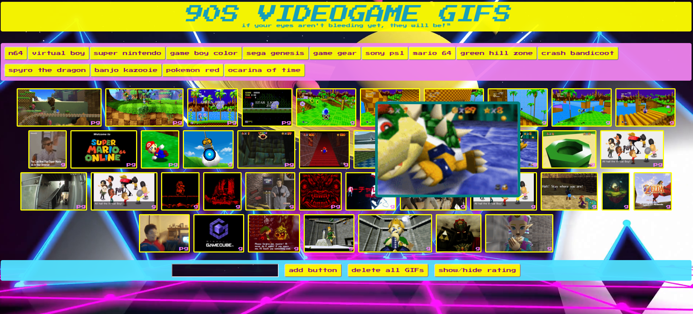

# videogame-gifs
Uses jQuery and AJAX calls to generate a variety of gifs in an eye-bleedingly 90s environment.

# goals
Practice manipulating DOM elements and images with jQuery, making API calls, and desperate attempts to recapture the magic of childhood.

# try it yourself!
https://jwkeena.github.io/videogame-gifs/

